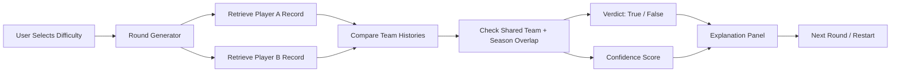

# Teammates?

`Teammates?` is a React + TypeScript web game that asks whether two NBA players ever played together on the same NBA team for at least one season. It matters because it demonstrates a practical AI/RAG-style pattern: retrieve structured evidence first, reason over it second, and only then present a result to the user with an explanation and confidence score.

My original project from Modules 1-3 was also `Teammates?`. The original goal was to turn NBA teammate trivia into a retrieval-based system rather than a hardcoded quiz, using player/team/season histories as the source of truth. In its earlier form, the focus was on proving the overlap logic, validating whether teammate answers could be computed reliably, and wrapping that logic in an engaging game flow.

## Demo Walkthrough
I use screenshots in this README as the walkthrough artifact for the system running end-to-end.

Note: the screenshots you shared in chat are not available to me as local files I can commit directly, so I prepared the repository to store them in `assets/screenshots/`. If you place those provided screenshots there, the links below will render automatically.

- Landing screen: `assets/screenshots/landing-screen.png`
- Gameplay prompt: `assets/screenshots/gameplay-question.png`
- Correct verdict: `assets/screenshots/correct-verdict.png`
- Incorrect verdict: `assets/screenshots/incorrect-verdict.png`
- Hard-mode example: `assets/screenshots/hard-mode-example.png`

## Why This Project Matters
This project shows how AI collaboration can be grounded in evidence instead of imitation. The app does not store “Stephen Curry + Klay Thompson = True” inside the UI. It retrieves each player’s team history, compares overlaps, computes a verdict, and then exposes both an explanation and a confidence score. That same workflow applies to real AI products such as search copilots, internal knowledge systems, and decision-support interfaces.

## What the Project Does
- Lets the player choose `Easy`, `Medium`, or `Hard`
- Shows two NBA players with real headshots
- Asks whether they were ever teammates
- Uses a local knowledge base of 300+ players
- Computes the answer by checking team/season overlap
- Balances rounds so the game does not degenerate into mostly `False`
- Returns a short evidence-based explanation
- Displays a confidence score so the system communicates uncertainty

## Architecture Overview
At a high level, the app has four layers:

1. `UI Layer`
   React components render the landing page, scoreboard, player cards, answer controls, and explanation panel.

2. `Knowledge Base`
   Player data lives locally in `src/data/players.ts` and headshot mappings live in `src/data/headshotIds.json`.

3. `Retrieval + Reasoning Layer`
   `src/utils/game.ts` retrieves two player records, checks shared teams, computes season overlap, and produces the verdict, explanation, and confidence score.

4. `Round Generation Layer`
   The generator selects candidate matchups, estimates difficulty, and balances true/false output while respecting data quality rules.

### System Architecture Diagram


## Repository Structure
- `src/App.tsx`
  Main game state and round flow.
- `src/components/`
  UI components like player cards, scoreboard, and explanation panel.
- `src/data/players.ts`
  Local player dataset.
- `src/data/headshotIds.json`
  Official NBA headshot ID mapping for the fixed roster.
- `src/utils/game.ts`
  Match generation, teammate checking, explanation generation, and confidence scoring.
- `assets/`
  Reserved for screenshots, diagrams, and demo assets.
- `model_card.md`
  Reflection document covering AI collaboration, bias, risks, and testing outcomes.

## Setup Instructions
1. Clone the repository.
2. Move into the project directory.
3. Install dependencies.
4. Start the dev server.

```bash
git clone <your-repo-url>
cd DidTheyPlayTogether
npm install
npm run dev
```

Then open the Vite URL shown in your terminal, usually:

```bash
http://localhost:5173
```

## Sample Interactions
These examples show the actual retrieval-style behavior of the game.

### Example 1
Input:
- Difficulty: `Easy`
- Players: `Jaylen Brown` and `Jayson Tatum`
- User guess: `True`

AI output:
- Verdict: `Correct`
- Confidence: `99%`
- Explanation: `Jaylen Brown and Jayson Tatum played together on the Boston Celtics from 2017-18 to 2023-24.`

### Example 2
Input:
- Difficulty: `Easy`
- Players: `Luka Doncic` and `Nikola Jokic`
- User guess: `False`

AI output:
- Verdict: `Correct`
- Confidence: `90%`
- Explanation: `Luka Doncic and Nikola Jokic never shared an NBA team.`

### Example 3
Input:
- Difficulty: `Hard`
- Players: `Seth Curry` and `Nick Richards`
- User guess: `False`

AI output:
- Verdict: `Incorrect`
- Confidence: `86%`
- Explanation: `Seth Curry and Nick Richards played together on the Charlotte Hornets from 2023-24.`

## Reliability and Evaluation
This project includes an explicit reliability mechanism rather than only asserting answers.

### Confidence Scoring
Each verdict includes a confidence score based on:
- whether both players come from the trusted multi-season historical dataset
- whether the result comes from direct season overlap
- how many overlapping seasons exist
- whether the result depends on weaker snapshot-style roster data

This gives the user a visible indication of how strongly the system trusts its own answer.

### Human Evaluation
I manually spot-checked generated outputs against real NBA roster history and corrected failure cases. This process surfaced an important issue: fixed one-season roster snapshots were safe for some true teammate claims, but unsafe for all false claims. I changed the generator so snapshot-only players can support safe true matchups but do not produce unsafe false negatives.

### Error Handling by Design
I also added structural safeguards:
- every player in the fixed roster has a mapped headshot
- historical and snapshot data are treated differently
- true/false distribution is balanced at generation time

## Design Decisions and Trade-Offs
### Local knowledge base instead of live API calls
I kept the project local for speed, determinism, and ease of grading.

Trade-off:
- fast and reliable to run
- but the data must be updated manually

### Retrieval-based answers instead of hardcoded UI facts
I wanted the explanation and verdict to come from the same evidence source.

Trade-off:
- more trustworthy and scalable
- but more sensitive to data quality problems

### Fixed roster with real images
I used a fixed player pool so every player in the game has a known headshot and known data profile.

Trade-off:
- strong visual quality and fewer broken states
- but less broad than a fully live league database

### Two-tier data trust model
Players are tagged as either `historical` or `roster_snapshot`.

Trade-off:
- better factual safety
- more complex round-generation logic

### Formula-based difficulty
Difficulty is driven by factors like fame, recency, shared seasons, titles, and team popularity.

Trade-off:
- much more replayability
- requires tuning and can expose bad data faster

## Testing Summary
### What worked
- Team/season overlap logic reliably identified obvious teammate pairs.
- The headshot mapping system now guarantees a real player image for the fixed roster.
- Confidence scoring exposed the difference between stronger and weaker evidence.
- The single-screen play layout became more usable after the answer panel was restructured.

### What did not work initially
- Naive random pairing produced far too many `False` rounds.
- Snapshot-only roster data created stale false negatives after real-world roster changes.
- Image fallback behavior briefly masked data issues instead of solving them.

### What I learned
- AI systems fail at the data boundary before they fail in the UI.
- Replayable generators reveal correctness bugs faster than static demos.
- A confidence score is useful, but only if the underlying heuristics are honest about uncertainty.

## Reflection
This project taught me that AI problem-solving is less about making a system sound intelligent and more about making it reason from trustworthy evidence. The most important work was building the retrieval pipeline, constraining unsafe generation patterns, and exposing confidence rather than pretending every answer is equally certain.

It also reinforced that a single visible factual error can destroy user trust. That shaped how I thought about data freshness, evaluation, and failure handling. From a portfolio standpoint, this project shows that I can build a polished interface, structure a local knowledge system, debug correctness problems, and make defensible trade-offs between UX, replayability, and factual reliability.

## Required Submission Files
- Functional code: included
- `README.md`: included
- `model_card.md`: included
- System architecture diagram: embedded in this README
- Dedicated asset folder: `assets/`

## Future Improvements
- Expand the number of players with full multi-season historical trajectories
- Add automated regression tests for known teammate and non-teammate pairs
- Add a visible data freshness statement in the UI
- Add analytics to tune difficulty based on real play behavior
- Add a Loom video link if a narrated demo is later recorded
